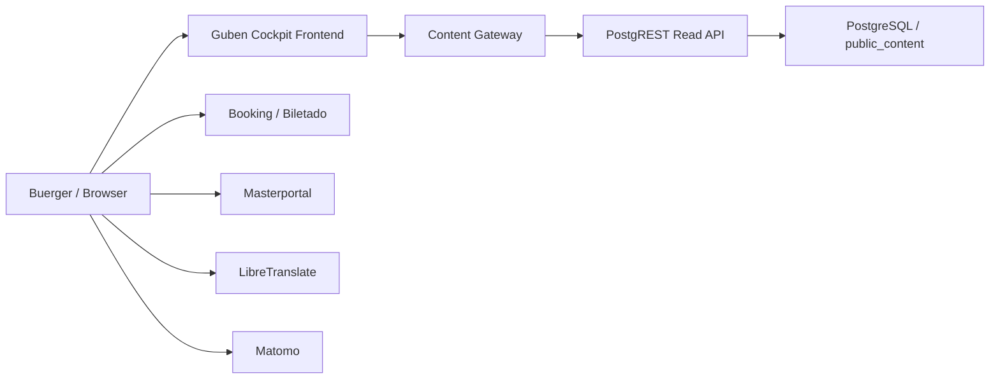
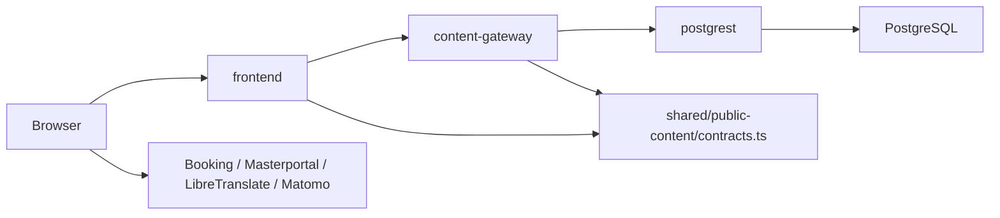
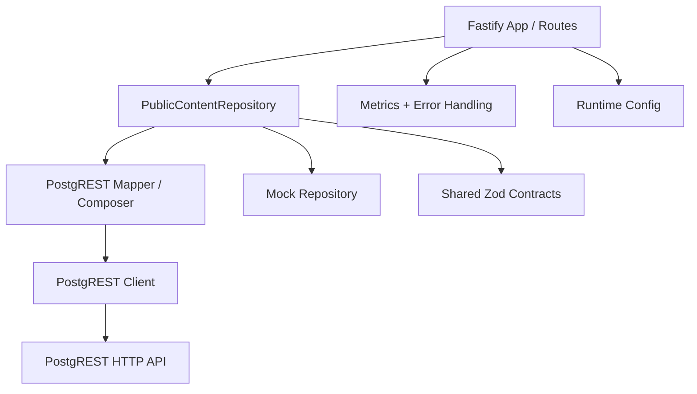
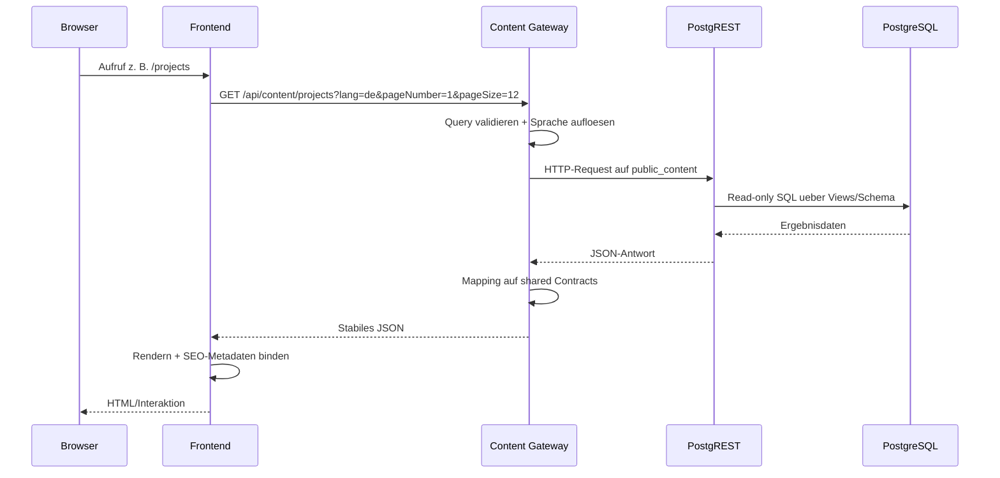
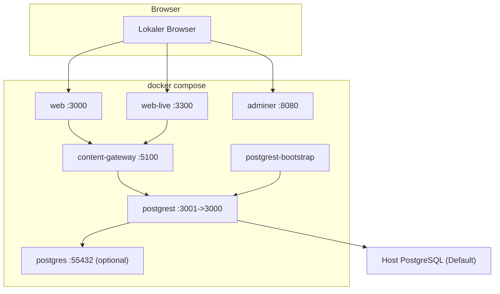

# arc42: Guben Cockpit

Stand: 17. Maerz 2026

Diese Dokumentation beschreibt die aktuelle Zielarchitektur des Repositorys `guben-cockpit-old` nach dem arc42-Template. Sie konsolidiert die im Repository belegte Architektur fuer Maintainer und Betreiber. Operative Detailablaeufe bleiben in den bestehenden Spezialdokumenten:

- [Systemdokumentation](./system-documentation.md)
- [Public Content Gateway Rollout](./public-content-gateway-rollout.md)
- [Deploy Runbook](./deploy-runbook.md)

## 1. Einfuehrung und Ziele

### 1.1 Aufgabenstellung

Dieses Repository betreibt den oeffentlichen Web-Stack fuer `cockpit.guben.de`. Der aktive Architekturpfad besteht aus:

- `frontend/` als oeffentliche React/Vite-Anwendung
- `content-gateway/` als Fastify/TypeScript-API fuer `/api/content/*`
- `postgrest/` als read-only HTTP-Fassade auf PostgreSQL
- `shared/public-content/contracts.ts` als gemeinsame Quelle fuer Zod-Schemas und Typen

Der fruehere `.NET`-CMS-/Admin-Pfad ist nicht mehr Teil der Zielarchitektur dieses Branches. Historische oder produktionsseitige Uebergaenge werden nur dort erwaehnt, wo sie fuer Betrieb und Deployment relevant bleiben.

### 1.2 Qualitaetsziele

| Prioritaet | Ziel | Bedeutung fuer das System |
| --- | --- | --- |
| 1 | Stabile Content-Vertraege | Frontend und Gateway muessen dieselben JSON-Vertraege verwenden und validieren. |
| 2 | Sichere Datenbereitstellung | Keine Browser-Exponierung interner Datenbankzugriffe; PostgREST bleibt read-only und intern. |
| 3 | Verfuegbarkeit und kontrolliertes Fehlerverhalten | Upstream-Ausfaelle muessen ueber ein einheitliches Fehlerformat und Health-/Readiness-Signale sichtbar werden. |
| 4 | SEO-faehige Auslieferung | Oeffentliche Seiten sollen ueber Build/Prerender crawlbare HTML-Ausgaben erhalten. |
| 5 | Gute Betreibbarkeit | Docker-, GHCR- und Portainer-Pfade muessen nachvollziehbar dokumentiert und mit Metriken beobachtbar sein. |

### 1.3 Stakeholder

| Stakeholder | Interesse |
| --- | --- |
| Maintainer des Frontends | Verstehen, wie oeffentliche Routen an Content-Vertraege und Gateway-Aufrufe gebunden sind. |
| Betreiber / DevOps | Verstehen, wie lokale und produktive Laufzeit, Images, Ports, Health und Monitoring zusammenspielen. |
| Gateway-Entwickler | Verstehen, wie Routen, Repository, Mapper, Upstream-Clients und Contracts getrennt sind. |
| Reviewer / Architekten | Nachvollziehen, welche Entscheidungen im Repository bewusst getroffen wurden und wo Risiken verbleiben. |

## 2. Randbedingungen

### 2.1 Technische Randbedingungen

- Frontend: React 18, Vite 5, TanStack Router, TanStack Query
- Gateway: Node.js >= 22, TypeScript, Fastify 5, Zod
- Datenzugriff: PostgREST `v12.2.8` auf PostgreSQL
- Gemeinsame Contract-Definitionen: `shared/public-content/contracts.ts`
- Lokaler Betrieb: `docker compose`, optionale lokale PostgreSQL via Compose-Profil `local-db`
- Produktiver Build: GitHub Actions baut und publiziert GHCR-Images fuer `web` und `content-gateway`
- Produktiver Deploy: Portainer-Stack mit `stack.prod.yml`

### 2.2 Organisatorische und fachliche Randbedingungen

- Das Repository beschreibt nur den Public-Content-Pfad.
- Die Zielgruppe der Dokumentation sind Maintainer und Betreiber, nicht Fachanwender.
- Operative Schrittfolgen werden nicht dupliziert, sondern ueber die bestehenden Runbooks referenziert.
- Der Branch arbeitet mit einer reduzierten Zielarchitektur, auch wenn einzelne produktive Artefakte noch Hybridspuren tragen.

### 2.3 Historische Randbedingung

Die Branch-Dokumentation beschreibt eine bereinigte Zielarchitektur ohne aktiven `.NET`-CMS-/Admin-Stack. Im produktiven Portainer-Stack existiert laut `stack.prod.yml` weiterhin ein legacy `guben-api-prod`-Container. Dieser bleibt betriebliche Realitaet, ist aber nicht Teil des Public-Content-Zielpfads dieses Repositorys.

## 3. Kontextabgrenzung

### 3.1 Fachlicher Kontext

| Nachbar | Beziehung |
| --- | --- |
| Browser-Nutzer | Ruft die oeffentlichen Seiten und interaktiven Inhalte ab. |
| Booking / Biletado | Wird fuer buchbare Inhalte direkt aus dem Browser genutzt. |
| Masterportal | Liefert Karten- und Geodaten fuer Kartenseiten und Einbettungen. |
| LibreTranslate | Wird fuer Uebersetzungsfunktionen aus dem Frontend genutzt. |
| Matomo | Wird fuer Tracking im Browser eingebunden. |
| PostgreSQL | Ist die fachliche Quelle fuer das read-only `public_content`-Schema. |

### 3.2 Technischer Kontext

| Schnittstelle | Richtung | Zweck |
| --- | --- | --- |
| `GET /api/content/*` | Browser/Frontend -> Gateway | Oeffentliche, stabile Content-Vertraege fuer Seiten und Listings |
| `GET /health`, `/health/live`, `/health/ready`, `/metrics` | Betrieb -> Gateway | Liveness, Readiness und Prometheus-kompatible Beobachtung |
| HTTP gegen PostgREST | Gateway -> PostgREST | Interner read-only Datenzugriff auf `public_content` |
| GHCR Images | GitHub Actions -> Deployment | Bereitstellung von Web- und Gateway-Containern |
| Portainer Stack API/UI | Betreiber -> Produktion | Rollout, Update und Rollback des Produktions-Stacks |

### 3.3 Externe und interne Systemgrenzen

- Der Browser sieht das Frontend und externe Web-Dienste.
- Der Browser sieht nicht direkt PostgREST oder die Datenbank.
- Das Gateway kapselt Datenzugriffe, Fehleruebersetzung, Sprachaufloesung und Contract-Stabilitaet.
- PostgREST exponiert nur eine interne, read-only Schicht ueber `public_content`.

## 4. Loesungsstrategie

Die Architektur verfolgt eine bewusst schlanke Public-Content-Strategie:

1. Das bestehende Frontend bleibt die aktive Benutzeroberflaeche.
2. Ein serverseitiges Gateway entkoppelt Frontend und Datenquellen.
3. PostgREST stellt relationale Lesedaten schnell und kontrolliert als HTTP-Ressourcen bereit.
4. Zod-Vertraege liegen in einem gemeinsamen Modul, damit Frontend und Gateway dieselbe fachliche Form validieren.
5. SEO wird nicht dem Browser allein ueberlassen, sondern ueber den Build-/Prerender-Pfad unterstuetzt.
6. Rollout und Betrieb bleiben ueber Konfiguration steuerbar, insbesondere ueber `VITE_PUBLIC_CONTENT_SOURCE`, Health-Endpunkte und observierbare Gateway-Metriken.

Diese Strategie minimiert Browserwissen ueber interne Datenquellen und haelt die HTTP-Vertraege des Public-Content-Pfads stabil, obwohl sich interne Implementierungsdetails aendern koennen.

## 5. Bausteinsicht

### 5.1 Whitebox Gesamtsystem

| Baustein | Verantwortung |
| --- | --- |
| `frontend/` | Rendert oeffentliche Routen, ruft Gateway-Daten ab, bindet SEO-Metadaten und externe Browser-Dienste ein. |
| `content-gateway/` | Liefert stabile JSON-Endpunkte, validiert Queries, loest Sprache auf, uebersetzt Fehler und sammelt Metriken. |
| `postgrest/` | Exponiert read-only Daten des Schemas `public_content` ueber HTTP. |
| PostgreSQL | Haelt die Datenbasis, auf die PostgREST lesend zugreift. |
| `shared/public-content/contracts.ts` | Definiert gemeinsame Zod-Schemas und Typen fuer Content- und Fehlervertraege. |

### 5.2 Frontend

Wesentliche interne Sicht:

- Routing in `frontend/src/routes/*`
- Public-Content-Zugriff ueber `frontend/src/public-content/*`
- SEO-Bindung ueber `useRouteMetadata`
- Prerender- und Verifikationsskripte in `frontend/scripts/*`
- Rollout-Steuerung ueber `VITE_PUBLIC_CONTENT_SOURCE`

Das Frontend trennt damit Seitendarstellung, Datenzugriff und Laufzeitumschaltung fuer Public Content.

### 5.3 Content Gateway

| Interner Baustein | Verantwortung |
| --- | --- |
| `src/app.ts` | HTTP-Routen, Query-Validierung, Sprachaufloesung, Health-/Metrics-Endpunkte, Fehlerantworten |
| `src/config.ts` | Validierung der Laufzeitkonfiguration fuer `mock` oder `postgrest` |
| `src/content/content-repository.ts` | Abstraktion des Public-Content-Repositorys |
| `src/content/postgrest-content-repository.ts` | Zusammensetzen der fachlichen Antworten aus PostgREST-Daten |
| `src/content/postgrest-content-mapper.ts` | Mapping von Upstream-Daten auf stabile Contract-Modelle |
| `src/upstream/postgrest-client.ts` | HTTP-Zugriff auf PostgREST mit Timeout |
| `src/metrics.ts` | Histogramm-artige Request-Latenzen und Upstream-Fehlerzaehler |
| `src/errors.ts` | Einheitliches Gateway-Fehlermodell |

### 5.4 Shared Contracts

Die gemeinsame Datei `shared/public-content/contracts.ts` ist die kanonische Quelle fuer:

- Seitendaten wie `homeContentSchema`, `projectsContentSchema`, `eventsContentSchema`
- Detaildaten wie `eventDetailContentSchema`, `mapContentSchema`, `footerContentSchema`
- Hilfstypen wie `seoMetadataSchema`, `pageHeroSchema`, `dashboardDropdownSchema`
- Fehlervertraege ueber `gatewayErrorSchema`

Frontend und Gateway importieren damit dieselbe Laufzeitvalidierung und dieselben Typen.

### 5.5 PostgREST und Bootstrap

- `postgrest/` enthaelt Runtime-Konfiguration, SQL-Bootstrap und Sicherheitschecks.
- `postgrest-bootstrap` fuehrt Rollen, Schema, Views, Grants und Checks idempotent aus.
- PostgREST exponiert nur die anonyme read-only Rolle `guben_public_content_reader` fuer das Schema `public_content`.

### 5.6 Oeffentliche HTTP-Schnittstellen des Gateways

| Endpoint | Zweck |
| --- | --- |
| `GET /health` | Liveness plus aktiver `CONTENT_SOURCE_MODE` |
| `GET /health/live` | explizite Liveness-Pruefung |
| `GET /health/ready` | Readiness fuer den aktiven Source-Mode |
| `GET /metrics` | Prometheus-kompatible Gateway-Metriken |
| `GET /api/content/home` | Startseite inkl. SEO und Dashboard-Vorschau |
| `GET /api/content/dashboard` | Dashboard-Dropdowns und Tabs |
| `GET /api/content/projects` | Projektlisten mit Paging |
| `GET /api/content/events` | Eventlisten mit Paging und Filtern |
| `GET /api/content/events/:id` | Event-Detail |
| `GET /api/content/map` | Karteninhalt und Seitentexte |
| `GET /api/content/footer` | Footer-Inhalte |
| `GET /api/content/booking-tenants` | Oeffentliche Booking-Tenant-IDs |

Wichtige Query-Parameter:

- `lang`
- `pageNumber`
- `pageSize`
- bei Events zusaetzlich `title`, `category`, `startDate`, `endDate`, `sortBy`, `ordering`, `distance`

## 6. Laufzeitsicht

### 6.1 Content-Abruf fuer eine oeffentliche Route

### 6.2 Fehlerfall bei Upstream-Ausfall

1. Ein Request auf `/api/content/*` trifft im Gateway ein.
2. Der PostgREST-Client laeuft in einen Timeout oder erhaelt eine ungueltige Upstream-Antwort.
3. Das Gateway normalisiert den Fehler auf den einheitlichen Fehlervertrag.
4. Der Client erhaelt eine nicht-2xx-Antwort mit `gatewayErrorSchema`.
5. Gleichzeitig erhoeht das Gateway den Zaehler `gateway_upstream_failures_total`.
6. Readiness und Monitoring koennen den Zustand getrennt von der reinen Liveness sichtbar machen.

### 6.3 Sprachaufloesung pro Request

Die Sprachaufloesung im Gateway folgt fester Prioritaet:

1. `lang` Query-Parameter
2. `Accept-Language` Header
3. `DEFAULT_LANGUAGE` aus der Konfiguration

Das Gateway kuerzt die Sprache auf einen zweistelligen Lowercase-Code.

### 6.4 Lokaler Docker-Start

1. `postgrest-bootstrap` startet und fuehrt die SQL-Artefakte idempotent aus.
2. `postgrest` startet erst nach erfolgreichem Bootstrap.
3. `content-gateway` startet mit `CONTENT_SOURCE_MODE=postgrest`.
4. `web` oder `web-live` starten anschliessend gegen das Gateway.
5. Optional kann statt der Host-Datenbank eine lokale Compose-PostgreSQL per Profil `local-db` zugeschaltet werden.

## 7. Verteilungssicht

### 7.1 Lokale Deployment-Sicht

Wichtige Default-Ports aus `docker-compose.yml`:

| Dienst | Host-Port |
| --- | --- |
| `web` | `3000` |
| `web-live` | `3300` |
| `content-gateway` | `5100` |
| `postgrest` | `3001` |
| `adminer` | `8080` |
| `postgres` (optional) | `55432` |

Der Standard-Compose-Stack nutzt standardmaessig eine bereits laufende Host-PostgreSQL ueber `host.docker.internal`. Die lokale `postgres`-Instanz aus dem Repository wird nur ueber das Profil `local-db` zugeschaltet.

### 7.2 Produktionssicht

- GitHub Actions bauen bei Tags Docker-Images fuer:
  - `ghcr.io/smart-village-solutions/guben-cockpit-web`
  - `ghcr.io/smart-village-solutions/guben-cockpit-content-gateway`
- Der produktive Rollout erfolgt ueber Portainer und `stack.prod.yml`.
- Im produktiven Stack laufen mindestens:
  - `guben-web-prod`
  - `guben-content-gateway-prod`
  - `guben-postgrest-prod`
  - `guben-db-prod`
- Zusaetzlich enthaelt `stack.prod.yml` derzeit noch `guben-api-prod` als Legacy-Komponente ausserhalb des beschriebenen Zielpfads.

### 7.3 Verteilungsrelevante Konfigurationsgrenzen

| Baustein | Relevante Variablen |
| --- | --- |
| Frontend | `VITE_CONTENT_GATEWAY_URL`, `VITE_PUBLIC_CONTENT_SOURCE`, `VITE_BOOKING_URL`, `VITE_TRANSLATE_URL`, `VITE_MATOMO_JS` |
| Gateway | `PORT`, `LOG_LEVEL`, `PUBLIC_BASE_URL`, `CONTENT_SOURCE_MODE`, `DEFAULT_LANGUAGE`, `FALLBACK_LANGUAGE`, `POSTGREST_URL`, `POSTGREST_TIMEOUT_MS`, `POSTGREST_SCHEMA` |
| PostgREST | `PGRST_DB_URI`, `PGRST_DB_SCHEMAS`, `PGRST_DB_ANON_ROLE`, `PGRST_OPENAPI_MODE`, `PGRST_DB_ROOT_SPEC` |

## 8. Querschnittliche Konzepte

### 8.1 Sprachaufloesung

Das Gateway loest Sprache zentral auf und entkoppelt damit Frontend-Routen von fachlichen Lokalisierungsdetails im Upstream.

### 8.2 Contract-Validierung und Typen

- Alle oeffentlichen Content-Vertraege werden in `shared/public-content/contracts.ts` definiert.
- Das Gateway validiert seine Antworten gegen diese Zod-Schemas.
- Das Frontend validiert Gateway-Antworten ebenfalls zur Laufzeit.
- `frontend/scripts/verify-gateway-contracts.ts` prueft die Vertragskompatibilitaet explizit.

### 8.3 Konfiguration und Source-Mode

- Das Gateway kennt nur die Source-Modes `mock` und `postgrest`.
- Das Frontend schaltet Public Content per `VITE_PUBLIC_CONTENT_SOURCE` zwischen `gateway` und `disabled`.
- Der Default im Frontend ist `gateway`, solange kein expliziter Disabled-State gesetzt ist.

### 8.4 Fehlervertrag

Das Gateway liefert ein einheitliches Fehlerformat:

- `code`: `UPSTREAM_TIMEOUT`, `UPSTREAM_UNAVAILABLE`, `INVALID_UPSTREAM_PAYLOAD`, `NOT_FOUND`, `INTERNAL_ERROR`
- `upstream`: `postgrest`, `gateway`
- `retryable`: boolesche Wiederholbarkeitsinformation
- `requestId`: Korrelation fuer Logging und Betrieb

### 8.5 Observability

- `GET /metrics` liefert Prometheus-kompatible Histogramm-Metriken fuer `gateway_request_duration_ms`.
- Upstream-Fehler werden ueber `gateway_upstream_failures_total` gezaehlt.
- `GET /health/live` und `GET /health/ready` trennen Liveness von Readiness.
- Die Rollout-Dokumentation empfiehlt Alerts fuer Upstream-Fehler und p95-Latenz.

### 8.6 SEO und Prerender

- Das Frontend baut ueber `npm run build` eine SPA plus Prerender-Ausgaben.
- `prerender-public-routes.ts` und `verify-prerender.ts` sichern den SEO-relevanten Build-Pfad ab.
- Route-Metadaten werden ueber `useRouteMetadata` an Gateway-Content gebunden.

### 8.7 Sicherheitsgrenzen

- PostgREST bleibt interne Infrastruktur und ist keine Browser-API.
- Die Datenbank wird nur lesend ueber das Schema `public_content` exponiert.
- Browser-seitige Integrationen zu Booking, Masterportal, LibreTranslate und Matomo bleiben bewusst extern.
- Historische Admin-Pfade gehoeren nicht zur aktiven Zielarchitektur dieses Branches.

## 9. Architekturentscheidungen

| Entscheidung | Status | Begruendung |
| --- | --- | --- |
| Frontend bleibt React/Vite-Anwendung | getroffen | Vermeidet einen Voll-Neubau und haelt die UI im bestehenden Stack. |
| Serverseitiges Content Gateway als oeffentliche API | getroffen | Kapselt Datenquellen, Fehlerverhalten und Contract-Stabilitaet. |
| PostgREST als read-only Datenzugriff | getroffen | Reduziert handgeschriebene Read-Controller und begrenzt die Datenbank-Exponierung. |
| Shared Zod Contracts fuer Frontend und Gateway | getroffen | Verhindert Contract-Drift und sichert Laufzeitvalidierung. |
| Readiness, Metriken und strukturierte Fehler | getroffen | Unterstuetzt Betrieb, Alerting und reproduzierbares Fehlerverhalten. |
| SEO ueber Prerender/Build- und Route-Metadaten | getroffen | Ermoeglicht crawlbare oeffentliche Inhalte ohne Plattformwechsel. |

Quellen fuer diese Entscheidungen:

- `openspec/changes/legacy-frontend-content-gateway/design.md`
- `openspec/changes/content-gateway-architecture-hardening/design.md`

## 10. Qualitaetsanforderungen

### 10.1 Qualitaetsbaum

- Funktionale Korrektheit
  - Content-Endpunkte liefern die erwarteten JSON-Vertraege
  - Sprachaufloesung folgt der dokumentierten Prioritaet
- Sicherheit
  - Keine direkte Browser-Kommunikation mit Datenbank oder internem PostgREST
  - Read-only Exponierung des Schemas `public_content`
- Verfuegbarkeit
  - Liveness und Readiness sind getrennt sichtbar
  - Upstream-Ausfaelle werden als standardisierte Fehler gemeldet
- Wartbarkeit
  - Geteilte Contracts fuer Frontend und Gateway
  - Architektur in Frontend, Gateway und Datenzugriff klar getrennt
- Betreibbarkeit
  - Docker- und Portainer-Pfade sind dokumentiert
  - Metriken sind Prometheus-kompatibel
- SEO
  - Oeffentliche Routen werden vorgerendert und ihre Metadaten geprueft

### 10.2 Konkrete Qualitaetsszenarien

| Szenario | Erwartetes Verhalten |
| --- | --- |
| Ein Browser ruft `/projects` auf | Frontend rendert Seite, ruft Gateway auf und bindet SEO-Metadaten aus dem Contract. |
| PostgREST ist nicht erreichbar | Gateway liefert einen standardisierten Fehler und erhoeht den Upstream-Fehlerzaehler. |
| Ein Deploy startet neuen Traffic | `health/ready` und `metrics` koennen fuer Smoke-Tests und Monitoring genutzt werden. |
| Ein Contract aendert sich | Frontend- und Gateway-Validierung sowie CI-Verifikation machen Drift sichtbar. |
| Public Content soll kurzfristig abgeschaltet werden | Frontend kann ueber `VITE_PUBLIC_CONTENT_SOURCE=disabled` ohne Codeaenderung umgeschaltet werden. |

### 10.3 Mess- und Pruefpunkte

- CI baut Gateway und Frontend und prueft die Contract-Kompatibilitaet.
- Rollout-Dokumente empfehlen p95-Latenzbeobachtung und Upstream-Failure-Alerts.
- Prerender-Ausgaben fuer zentrale oeffentliche Routen werden im Build verifiziert.

## 11. Risiken und technische Schulden

| Risiko / Schuld | Auswirkung | Umgang |
| --- | --- | --- |
| Produktionsstack ist noch hybrid | Zielarchitektur und Laufzeitrealitaet koennen auseinanderlaufen. | Deployment-Sicht klar trennen und Legacy-Komponente explizit markieren. |
| Aeltere Doku-Beispiele haben teils andere Ports oder Beispiele | Verwirrung bei Betrieb und Onboarding. | Diese arc42-Doku folgt dem aktuellen Repo-Zustand und verweist fuer Sonderfaelle auf Runbooks. |
| PostgREST-Views und Mapper koennen driften | Fachliche Antworten koennen trotz stabiler API intern brechen. | Shared Contracts, Mapper-Tests und Rollout-Checks beibehalten. |
| Gateway ist zusaetzlicher Hop | Mehr Latenz und neue Fehlerquelle. | Kurze Timeouts, Metriken, Health-/Readiness-Endpunkte und Rollback-Pfade nutzen. |
| Browserseitige externe Dienste bleiben ausserhalb des Gateways | Verfuegbarkeit und Datenschutz muessen je Integration separat betrachtet werden. | Integrationen bewusst als externe Systemgrenzen behandeln. |

## 12. Glossar

| Begriff | Bedeutung |
| --- | --- |
| `content-gateway` | Fastify/TypeScript-Service fuer stabile Public-Content-HTTP-Endpunkte |
| `postgrest` | Read-only HTTP-Fassade vor PostgreSQL |
| `postgrest-bootstrap` | Compose-Dienst, der Rollen, Schema, Views, Grants und Checks idempotent vorbereitet |
| `public_content` | Das ueber PostgREST exponierte read-only Schema bzw. die fachliche Leseschicht |
| `shared contracts` | Gemeinsame Zod-Schemas und Typen in `shared/public-content/contracts.ts` |
| `web` | Prerenderte/statische Auslieferung des Frontends im Docker-Setup |
| `web-live` | Interaktive Vite-Laufzeit fuer manuelle UI-Tests gegen das Gateway |
| `VITE_PUBLIC_CONTENT_SOURCE` | Frontend-Schalter fuer `gateway` oder `disabled` |
| `CONTENT_SOURCE_MODE` | Gateway-Schalter fuer `mock` oder `postgrest` |
