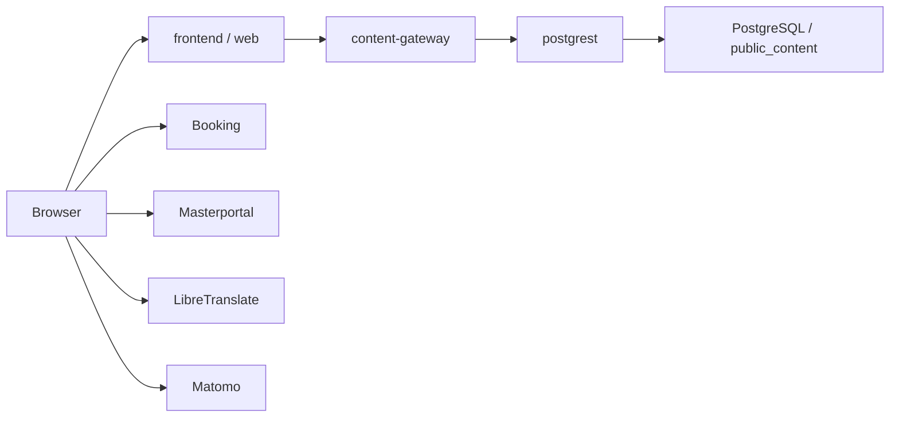

# Systemdokumentation

Diese Datei ist die kompakte technische Uebersicht des aktiven Public-Content-Stacks. Die vollstaendige Architekturbeschreibung liegt in der [arc42-Dokumentation](./arc42.md).

Weiterfuehrende Betriebsdokumente:

- [Public Content Gateway Rollout](./public-content-gateway-rollout.md)
- [Deploy Runbook](./deploy-runbook.md)

## Zweck

Das Repository betreibt den oeffentlichen Web-Stack fuer `cockpit.guben.de` mit drei aktiven Kernbausteinen:

- `frontend/` fuer die React/Vite-Website
- `content-gateway/` als Fastify-API fuer `/api/content/*`
- `postgrest/` als read-only Datenzugriff auf PostgreSQL

Der fruehere `.NET`-Admin-/CMS-Pfad ist in diesem Branch nicht mehr Teil der Zielarchitektur. Historische Produktionsartefakte bleiben nur dort bestehen, wo sie fuer den Betrieb noch relevant sind.

## Architektur auf einen Blick

## Laufzeitkomponenten

| Komponente | Aufgabe | Standard-Port |
| --- | --- | --- |
| `web` | prerenderte/statische Auslieferung des Frontends | `3000` |
| `web-live` | interaktive Vite-Laufzeit fuer manuelle UI-Tests | `3300` |
| `content-gateway` | liefert `/api/content/*`, Health und Metrics | `5100` |
| `postgrest` | interne read-only HTTP-Fassade auf `public_content` | `3001` extern, `3000` intern |
| `postgrest-bootstrap` | idempotentes SQL-Bootstrap fuer Rollen, Views und Checks | kein Port |
| `postgres` | optionale lokale DB aus diesem Repo | `55432` |
| `adminer` | Browser-Inspektion der DB | `8080` |

## Oeffentliche HTTP-Schnittstellen

### Gateway

- `GET /health`
- `GET /health/live`
- `GET /health/ready`
- `GET /metrics`
- `GET /api/content/home`
- `GET /api/content/dashboard`
- `GET /api/content/projects`
- `GET /api/content/events`
- `GET /api/content/events/:id`
- `GET /api/content/map`
- `GET /api/content/footer`
- `GET /api/content/booking-tenants`

Wichtige Query-Parameter:

- `lang`
- `pageNumber`
- `pageSize`
- bei Events zusaetzlich `title`, `category`, `startDate`, `endDate`, `sortBy`, `ordering`, `distance`

### PostgREST

PostgREST ist keine Browser-API. Der Dienst wird nur intern zwischen Gateway und Datenbank verwendet und exponiert das Schema `public_content` ueber die read-only Rolle `guben_public_content_reader`.

## Vertraege und Konfiguration

- Gemeinsame JSON-Vertraege liegen in [shared/public-content/contracts.ts](../shared/public-content/contracts.ts).
- Das Frontend prueft die Gateway-Vertraege zusaetzlich ueber `frontend/scripts/verify-gateway-contracts.ts`.
- Das Gateway kennt nur `CONTENT_SOURCE_MODE=mock` und `CONTENT_SOURCE_MODE=postgrest`.
- Das Frontend schaltet Public Content ueber `VITE_PUBLIC_CONTENT_SOURCE=gateway|disabled`.
- PostgREST verwendet konsistent `PGRST_DB_SCHEMAS=public_content`.

## Betrieb

- Der Standard-Compose-Stack nutzt standardmaessig eine bereits laufende Host-PostgreSQL ueber `host.docker.internal`.
- Eine lokale Compose-PostgreSQL wird nur ueber `--profile local-db` zugeschaltet.
- Der produktive Rollout verwendet `stack.prod.yml`.

## Referenzen

- [arc42-Architekturdokumentation](./arc42.md)
- [Public Content Gateway Rollout](./public-content-gateway-rollout.md)
- [Deploy Runbook](./deploy-runbook.md)
