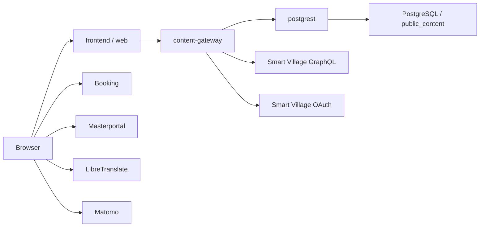

# Systemdokumentation

Diese Datei ist die kompakte technische Uebersicht des aktiven Public-Content-Stacks. Die vollstaendige Architekturbeschreibung liegt in der [arc42-Dokumentation](./arc42.md).

Weiterfuehrende Betriebsdokumente:

- [Public Content Gateway Rollout](./public-content-gateway-rollout.md)
- [Deploy Runbook](./deploy-runbook.md)

## Zweck

Das Repository betreibt den oeffentlichen Web-Stack fuer `cockpit.guben.de` mit drei aktiven Kernbausteinen:

- `frontend/` fuer die React/Vite-Website
- `content-gateway/` als Fastify-API fuer `/api/content/*`
- `postgrest/` als read-only Datenzugriff auf PostgreSQL

Der fruehere `.NET`-Admin-/CMS-Pfad ist in diesem Branch nicht mehr Teil der Zielarchitektur. Historische Produktionsartefakte bleiben nur dort bestehen, wo sie fuer den Betrieb noch relevant sind.

## Architektur auf einen Blick

## Laufzeitkomponenten

| Komponente | Aufgabe | Standard-Port |
| --- | --- | --- |
| `web` | prerenderte/statische Auslieferung des Frontends | `3000` |
| `web-live` | interaktive Vite-Laufzeit fuer manuelle UI-Tests | `3300` |
| `content-gateway` | liefert `/api/content/*`, Health und Metrics | `5100` |
| `postgrest` | interne read-only HTTP-Fassade auf `public_content` | `3001` extern, `3000` intern |
| `postgrest-bootstrap` | idempotentes SQL-Bootstrap fuer Rollen, Views und Checks | kein Port |
| `postgres` | optionale lokale DB aus diesem Repo | `55432` |
| `adminer` | Browser-Inspektion der DB | `8080` |

## Oeffentliche HTTP-Schnittstellen

### Gateway

- `GET /health`
- `GET /health/live`
- `GET /health/ready`
- `GET /metrics`
- `GET /api/content/home`
- `GET /api/content/dashboard`
- `GET /api/content/projects`
- `GET /api/content/featured-projects`
- `GET /api/content/featured-projects/:id`
- `GET /api/content/pois`
- `GET /api/content/pois/:id`
- `GET /api/content/public`
- `GET /api/content/events`
- `GET /api/content/events/:id`
- `GET /api/content/map`
- `GET /api/content/footer`
- `GET /api/content/booking-tenants`
- `GET /api/content/booking/faqs`

Wichtige Query-Parameter:

- `lang` fuer alle sprachabhaengigen Inhalte; ohne Parameter wird zuerst `Accept-Language`, danach `DEFAULT_LANGUAGE` verwendet
- `pageNumber` und `pageSize` fuer paginierte Listen
- bei Events zusaetzlich `title`, `category`, `startDate`, `endDate`, `sortBy`, `ordering`, `distance`
- bei POIs zusaetzlich `search`, `categoryIds` (mehrfach oder kommasepariert), `location`, `radius`, `sort=name|updatedAt` und `direction=asc|desc`

### Quellen je Inhaltsbereich

| Gateway-Inhalt | Primaerquelle | Verhalten und Fallback |
| --- | --- | --- |
| `/events`, `/events/:id` | Smart Village `eventRecords` / `eventRecord` | serverseitig per OAuth und GraphQL |
| `/pois`, `/pois/:id` | Smart Village `pointsOfInterest` / `pointOfInterest` | nur aktive und sichtbare, gueltig abbildbare POIs; Filterung und Paginierung erfolgen im Gateway |
| `/featured-projects`, `/featured-projects/:id` | Smart Village `genericItems(genericType: "FeaturedProject")` | Listenseiten-Metadaten kommen weiterhin aus PostgREST; ausgeliefert werden nur sichtbare und als publiziert markierte Items |
| `/booking/faqs` | Smart Village `genericItems(genericType: "FAQ")` | Filterung nach `payload.languageCode`; das Frontend behaelt seine lokalen Sprachdateien als Fallback fuer leere, ungueltige oder nicht erreichbare API-Antworten |
| `/home`, `/dashboard`, `/public` – Kacheln | Smart Village `genericItems(genericType: "COCKPIT_CARD")` | PostgREST liefert Dropdown-/Tab-Struktur und lokale Karten. Smart-Village-Karten werden sprach- und kategoriebasiert zugeordnet; wenn keine Karte zugeordnet werden kann oder der Abruf fehlschlaegt, bleiben alle lokalen Karten erhalten. |
| `/projects` sowie sonstige Bereiche von `/home`, `/dashboard`, `/public` | PostgREST | regulaere Projekte bleiben in PostgreSQL; im Public Bundle liegen Schulen und Marktplatz-Unternehmen gemeinsam unter `projects.items` mit `category=school` beziehungsweise `category=business` |
| `/map`, `/footer`, `/booking-tenants` | PostgREST | keine Smart-Village-Anreicherung |

`/api/content/public` ist der gebuendelte, fuer einfache Datenabfragen geeignete Endpunkt. Seine Dashboard-Karten stehen flach unter `home.cards`; die vollstaendige Dropdown-/Tab-Struktur liefern `/api/content/home` und `/api/content/dashboard`.

### PostgREST

PostgREST ist keine Browser-API. Der Dienst wird nur intern zwischen Gateway und Datenbank verwendet und exponiert das Schema `public_content` ueber die read-only Rolle `guben_public_content_reader`.

## Vertraege und Konfiguration

- Gemeinsame JSON-Vertraege liegen in [shared/public-content/contracts.ts](../shared/public-content/contracts.ts).
- Das Frontend prueft die Gateway-Vertraege zusaetzlich ueber `frontend/scripts/verify-gateway-contracts.ts`.
- Das Gateway kennt nur `CONTENT_SOURCE_MODE=mock` und `CONTENT_SOURCE_MODE=postgrest`.
- Das Frontend schaltet Public Content ueber `VITE_PUBLIC_CONTENT_SOURCE=gateway|disabled`.
- PostgREST verwendet konsistent `PGRST_DB_SCHEMAS=public_content`.
- Im Modus `postgrest` sind `SV_GRAPHQL_URL`, `SV_OAUTH_TOKEN_URL`, `SV_CLIENT_ID` und `SV_CLIENT_SECRET` gemeinsam verpflichtend. Die Zugangsdaten bleiben ausschliesslich im Gateway; der Browser greift nicht direkt auf Smart Village GraphQL zu.

### Smart-Village-Read-Cache

Validierte GraphQL-Antworten werden pro Gateway-Prozess zwischengespeichert. Erfolgreiche Antworten sind vier Minuten frisch; die zusaetzlichen einminuetigen Repository-Caches fuer Events und POIs koennen die normale Sichtbarkeit einer Aenderung auf ungefaehr fuenf Minuten verlaengern. Scheitert eine Aktualisierung, darf die letzte fachlich gueltige Antwort bis zu 24 Stunden nach ihrer letzten erfolgreichen Validierung weiterverwendet werden.

Cache und laufende Requests werden nicht zwischen Gateway-Prozessen geteilt und sind nach Neustart oder Deployment leer. `/health/ready` umgeht den Content-Cache und prueft PostgREST sowie Smart Village live.

## Betrieb

- Der Standard-Compose-Stack nutzt standardmaessig eine bereits laufende Host-PostgreSQL ueber `host.docker.internal`.
- Eine lokale Compose-PostgreSQL wird nur ueber `--profile local-db` zugeschaltet.
- Der produktive Rollout verwendet `stack.prod.yml`.

## Referenzen

- [arc42-Architekturdokumentation](./arc42.md)
- [Public Content Gateway Rollout](./public-content-gateway-rollout.md)
- [Deploy Runbook](./deploy-runbook.md)
