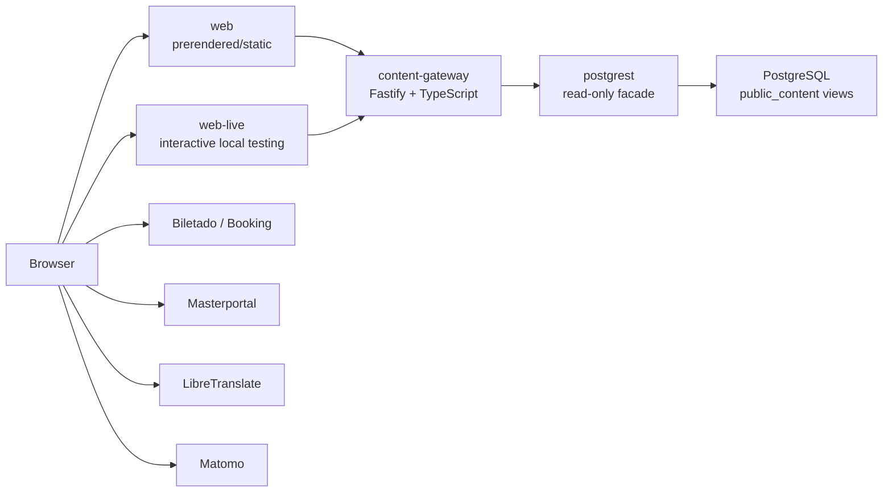

# Systemdokumentation

## Zweck

Dieses Repository betreibt den öffentlichen Web-Stack für `cockpit.guben.de`.

Der Branch enthält nur noch den Public-Content-Pfad:

- `frontend/` für die öffentliche Website
- `content-gateway/` als API für öffentliche Inhalte
- `postgrest/` als read-only Datenzugriff auf PostgreSQL

Ein früherer `.NET`-CMS-/Admin-Stack ist in diesem Branch entfernt worden und gehört nicht mehr zur Laufzeitarchitektur.

## Architektur



## Laufzeitkomponenten

| Komponente | Technologie | Aufgabe | Standard-Port |
| --- | --- | --- | --- |
| `web` | React, Vite, Node | baut/prerendert die öffentliche Website und serviert statische Dateien | `3000` |
| `web-live` | React, Vite, Node | interaktive Vite-Laufzeit für manuelle UI-Tests | `3300` |
| `content-gateway` | Fastify, TypeScript | liefert `/api/content/*`, normalisiert Daten und kapselt Fehler/Timeouts | `5100` |
| `postgrest` | PostgREST | read-only HTTP-Fassade auf die Sicht `public_content` | `3002` extern, `3000` intern |
| `postgrest-bootstrap` | `postgres:16-alpine` | wendet Rollen, Schema, Views, Grants und Checks idempotent an | kein eigener Port |
| `postgres` | PostgreSQL | optionale lokale DB aus diesem Repo, standardmäßig nicht aktiv | `55432` |
| `adminer` | Adminer | DB-Inspektion im Browser | `8088` |

## Repository-Struktur

| Pfad | Inhalt |
| --- | --- |
| `frontend/` | Public-Frontend, Prerendering, SEO-Checks, Docker-Entrypoints |
| `content-gateway/` | Gateway-API, Verträge, Upstream-Clients, Metriken |
| `postgrest/` | SQL-Bootstrap, Runtime-Konfiguration, Sicherheitschecks |
| `docs/` | Betriebs- und Systemdokumentation |
| `openspec/` | Change-Artefakte und Aufgabenhistorie |

## Datenfluss

### 1. Öffentliche Website

Produktions- bzw. Deploypfad:

1. Browser ruft `web` auf.
2. `web` liefert die prerenderte/statische öffentliche Website aus.
3. Das Frontend lädt Inhalte vom `content-gateway`.
4. Gateway liest Daten über PostgREST aus `public_content`.
5. Gateway liefert ein stabiles JSON-Contract an das Frontend.

Lokaler Entwicklungs- und Testpfad:

1. Browser ruft `web-live` auf.
2. `web-live` liefert die interaktive Vite-Variante für manuelle UI-Tests aus.
3. Das Frontend lädt Inhalte vom `content-gateway`.
4. Gateway liest Daten über PostgREST aus `public_content`.
5. Gateway liefert ein stabiles JSON-Contract an das Frontend.

### 2. Externe Dienste

Diese Zugriffe laufen direkt aus dem Browser:

- Booking/Biletado für buchbare Angebote
- Masterportal für Karten- und Geodaten
- LibreTranslate für Übersetzungen
- Matomo für Tracking

### 3. Sprachauflösung

Das Gateway bestimmt die Sprache so:

1. `lang` Query-Parameter
2. `Accept-Language` Header
3. `DEFAULT_LANGUAGE` aus der Gateway-Konfiguration

## Öffentliche HTTP-Schnittstellen

### Gateway

`content-gateway` bietet folgende Endpunkte:

| Endpoint | Zweck |
| --- | --- |
| `GET /health` | Liveness mit aktivem Source-Mode |
| `GET /health/live` | explizite Liveness |
| `GET /health/ready` | Readiness fuer den aktiven Source-Mode |
| `GET /metrics` | Prometheus-Metriken |
| `GET /api/content/home` | Startseite inkl. Hero, Dashboard und SEO |
| `GET /api/content/dashboard` | Dashboard-Dropdowns und Tabs |
| `GET /api/content/projects` | Projekte inkl. Pagination |
| `GET /api/content/events` | Events inkl. Filter, Kategorien und Booking-Tenants |
| `GET /api/content/events/:id` | Event-Detail |
| `GET /api/content/map` | Karten-Embed und Seitentexte |
| `GET /api/content/footer` | Footer-Inhalte |
| `GET /api/content/booking-tenants` | öffentliche Booking-Tenant-IDs |

Wichtige Query-Parameter:

- `lang`
- `pageNumber`
- `pageSize`
- bei Events zusätzlich `title`, `category`, `startDate`, `endDate`, `sortBy`, `ordering`, `distance`

### PostgREST

PostgREST ist nur für interne Systemkommunikation gedacht und exponiert ausschließlich das `public_content`-Schema mit der anonymen Rolle `guben_public_content_reader`.

## Öffentliche Seiten und ihre Datenquellen

| Route | Datenquelle |
| --- | --- |
| `/` | `home`, `dashboard`, `footer` |
| `/projects` | `projects`, `footer` |
| `/events` | `events`, `footer` |
| `/events/:eventId` | `event detail`, `footer` |
| `/map` | `map`, `footer` |
| `/booking` | `booking-tenants` plus externe Booking-API |
| `/booking/:title` | externe Booking-API |
| `/booking/room/:title` | externe Booking-API |

## Kernverträge

Die zentralen JSON-Vertraege werden aus [shared/public-content/contracts.ts](../shared/public-content/contracts.ts) importiert. Wichtige Typen:

- `homeContentSchema`
- `projectsContentSchema`
- `eventsContentSchema`
- `eventDetailContentSchema`
- `mapContentSchema`
- `footerContentSchema`
- `bookingTenantsContentSchema`
- `gatewayErrorSchema`

Das Frontend validiert diese Verträge zusätzlich über `frontend/scripts/verify-gateway-contracts.ts`.

## Docker-Betrieb

### Standardfall

Der Standard-Compose-Stack verwendet eine bereits laufende PostgreSQL-Instanz auf dem Host via `host.docker.internal`.

Start:

```bash
docker compose --env-file docker-compose.local.env up -d --build \
  postgrest-bootstrap \
  postgrest \
  content-gateway \
  web \
  web-live \
  adminer
```

Wichtige Eigenschaft:

- der Stack setzt die bestehende Datenbank nicht zurück
- das Bootstrap ist idempotent
- `docker compose down -v` sollte vermieden werden, wenn Volumes erhalten bleiben sollen

### Optional lokale PostgreSQL aus dem Repo

Wenn eine lokale Repo-DB benötigt wird:

```bash
docker compose --profile local-db up -d postgres
```

Dann muss `PGRST_DB_URI` auf `postgres:5432` zeigen.

## Konfiguration

### Frontend

Wichtige Build-/Runtime-Variablen:

- `VITE_CONTENT_GATEWAY_URL`
- `VITE_PUBLIC_CONTENT_SOURCE` (`gateway` oder `disabled`)
- `VITE_BOOKING_URL`
- `VITE_BOOKING_SDK`
- `VITE_BOOKING_LOGIN`
- `VITE_TRANSLATE_URL`
- `VITE_TRANSLATE_API_KEY`
- `VITE_MASTERPORTAL_URL`
- `VITE_MATOMO_JS`

### Gateway

Wichtige Variablen:

- `PORT`
- `LOG_LEVEL`
- `PUBLIC_BASE_URL`
- `MASTERPORTAL_URL`
- `CONTENT_SOURCE_MODE` (`mock` oder `postgrest`)
- `DEFAULT_LANGUAGE`
- `FALLBACK_LANGUAGE`
- `POSTGREST_URL`
- `POSTGREST_TIMEOUT_MS`
- `POSTGREST_SCHEMA`

### PostgREST

Wichtige Variablen:

- `PGRST_DB_URI`
- `PGRST_DB_SCHEMAS`
- `PGRST_DB_ANON_ROLE`
- `PGRST_OPENAPI_MODE`
- `PGRST_DB_ROOT_SPEC`

## Build- und Testpfad

### Frontend

Relevante Skripte aus `frontend/package.json`:

- `npm run dev`
- `npm run build`
- `npm run verify:gateway-contracts`
- `npm run prerender:public`
- `npm run verify:prerender`

### Gateway

Relevante Skripte:

- `npm start`
- `npm run build`
- `npm run lint`
- `npm test`
- `npm run typecheck`

## Deployment

GitHub Actions erzeugt zwei Images:

- `ghcr.io/agriculturedev/guben-cockpit-web`
- `ghcr.io/agriculturedev/guben-cockpit-content-gateway`

PostgREST wird nicht aus diesem Repo gebaut, sondern als Upstream-Image betrieben.

## Monitoring und Fehlerbilder

### Monitoring

- Gateway-Liveness: `/health`
- Gateway-Readiness: `/health/ready`
- Gateway-Metriken: `/metrics`
- strukturierte JSON-Logs im Gateway

Wichtige Metriken:

- `gateway_request_duration_ms`
- `gateway_upstream_failures_total`

### Typische Fehlerbilder

| Fehlerbild | Ursache |
| --- | --- |
| `503 UPSTREAM_TIMEOUT` | Gateway wartet zu lange auf PostgREST |
| `503 UPSTREAM_UNAVAILABLE` | PostgREST nicht erreichbar |
| `INVALID_UPSTREAM_PAYLOAD` | Upstream liefert nicht das erwartete Contract |
| Kartenfehler im Browser | häufig externes Masterportal-Problem, nicht zwingend aus dem eigenen Stack |

## Bekannte Betriebsentscheidungen

- Der Branch enthält keinen Admin-/CMS-Bereich mehr.
- Öffentliche Inhalte werden ausschließlich über den Gateway geladen.
- Gateway-basierte Public-Content-Routen koennen per `VITE_PUBLIC_CONTENT_SOURCE=disabled` kontrolliert deaktiviert werden.
- Die Datenbank wird lokal standardmäßig nicht vom Repo selbst verwaltet, sondern wiederverwendet.
- Für UI-Tests existieren zwei Frontend-Laufzeiten:
  - `web` für Prerender/SEO-nahe Ausgabe
  - `web-live` für interaktive Browser-Tests

## Verwandte Dokumente

- [README.md](../README.md)
- [public-content-gateway-rollout.md](./public-content-gateway-rollout.md)
- [postgrest/README.md](../postgrest/README.md)
